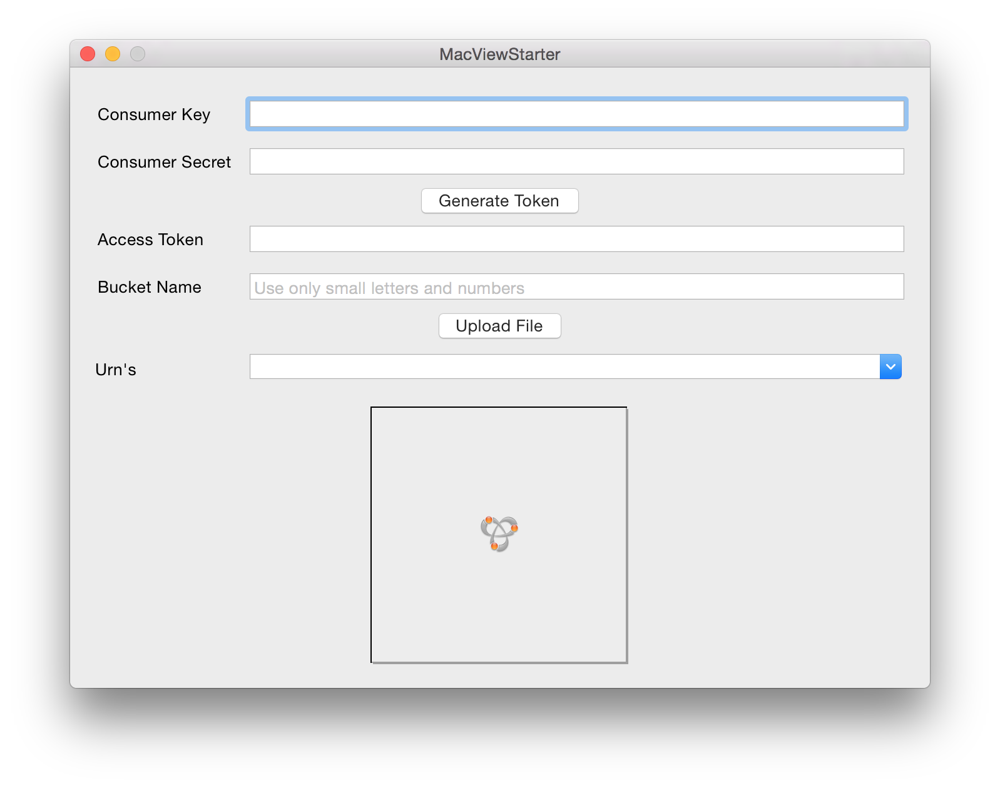

#Autodesk View and Data API Workflow Sample for MacOS written in Swift

##Description

A MacOS sample written in [Swift](https://developer.apple.com/swift) that illustrates the partial workflow with Autodesk View And Data API to achieve the following steps:

* Upload a file to bucket
* Start translation
* Get thumbnail

##Dependencies

This requires a version of Xcode that supports the Swift language. With the release of Xcode 6.1 and iOS 8, Swift 1.1 is final.

##Setup/Usage Instructions

* Before running the app, change the 'bucketKey' variable to something unique - it won't function if your bucket name collides with someone else's.
* Type in the Consumer Key and Consumer Secret in the dialog that you got for your application on [https://developer.autodesk.com](https://developer.autodesk.com).
* Generate Token - this is required before doing any further operation.
* Upload a file for translation.
* When a urn (id of a given uploaded file) is selected in the combo box, then the dialog will try to retrieve and display  its thumbnail.
* Next, use other web applications samples like [the Basic Node.Js sample](https://github.com/Developer-Autodesk/workflow-node.js-view.and.data.api) to view the models..

## License

This sample is licensed under the terms of the [MIT License](http://opensource.org/licenses/MIT). Please see the [LICENSE](LICENSE) file for full details.

##Written by

Written by [Adam Nagy](http://adndevblog.typepad.com/cloud_and_mobile/adam-nagy.html)
